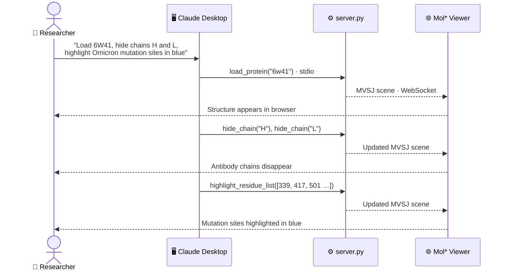
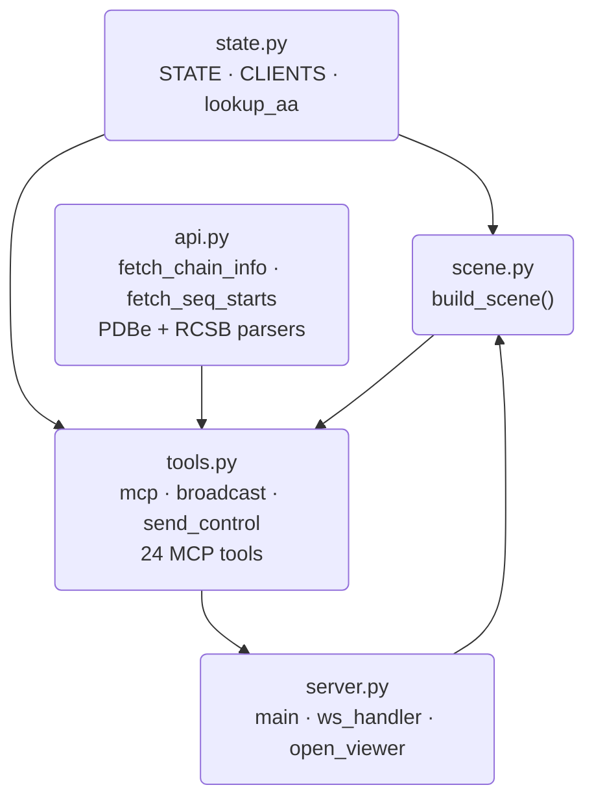
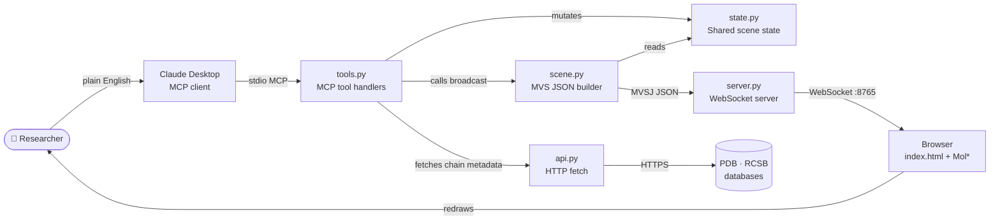
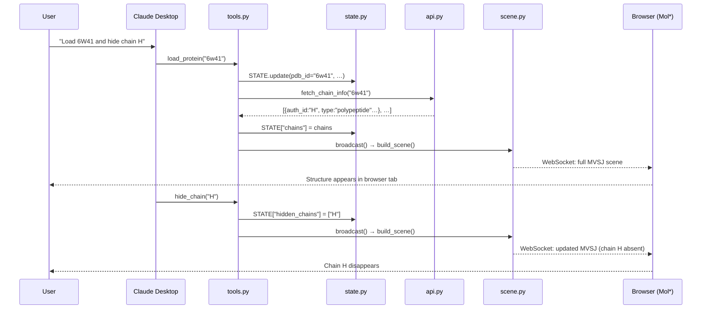

# molstar-mcp

> **Plain-English control of 3D protein structure visualization inside Claude Desktop — no extra software required.**

Built in 2.5 days at the Scripps Research Hackathon 2026.

---

## The problem we set out to solve

Modern LLM-powered research workflows are getting good at the 1D layer of biology. Claude can search the literature, query ClinVar for clinical variants, parse single-cell RNA-seq outputs, and return a ranked list of genes or mutations worth investigating.

But the readout is always a list. Residue 501. N501Y. Chain C. Numbers on a page.

What happens to those mutations in **3D space** is a completely different question — and one that has historically required a trained structural biologist, a dedicated software install (PyMOL, ChimeraX), and a lot of clicking. That gap — between "here are the mutations" and "here is what they look like on the folded protein" — is one that LLM workflows have largely skipped over. The reason this step got skipped isn't that 3D doesn't matter — it's that the tools to see it were never built for a conversation. They assume a human at a keyboard who already knows the software. The insight here is that the barrier was never the science; it was the interface. Make structural visualization speakable, and the 3D step can finally take its place alongside every other skill in an LLM workflow.

This project fills that gap.

---

## What this is

`molstar-mcp` is a local [MCP](https://modelcontextprotocol.io) server that lets Claude Desktop drive a [Mol*](https://molstar.org) 3D structure viewer with plain English. The viewer runs in a browser tab — nothing to install beyond the server itself.



The server maintains a scene state, converts it into a [MolViewSpec](https://molstar.org/mol-view-spec-docs/) (MVSJ) scene on every change, and pushes it over a WebSocket. The browser receives it and redraws — no Mol* internals touched.

---

## Demo: from mutation list to 3D insight

This is the workflow we demoed at the hackathon. Starting from Omicron variant mutations identified through genomic analysis:

> *"Load structure 6W41. Hide the antibody chains H and L. Highlight the Omicron variant mutation sites on chain C in blue: 339, 356, 371, 373, 375, 376, 403, 405, 408, 417, 435, 440, 445, 446, 450, 452, 455, 456, 460, 477, 481, 484, 486, 493, 498, 501, 505. Measure the distance between residue 501 and 505. Start spinning, record a 6 second video, then stop spinning."*

One prompt. Claude loads the SARS-CoV-2 RBD structure, hides the irrelevant chains, marks every mutation site, draws a distance measurement, and records a rotating video — all without the user touching the viewer.

---

## Tools available

| Category | Tools |
|---|---|
| Structure | `load_protein`, `get_structure_info` |
| Chains | `hide_chain`, `show_chain`, `show_all_chains` |
| Representation | `set_representation` — cartoon / ball_and_stick / spacefill / surface / putty |
| Color | `color_by` — solid color, hex, or schemes: Chainbow / ElementSymbol / SecondaryStructure |
| Highlights | `highlight_residue_list`, `highlight_residues`, `clear_highlights` |
| Measurements | `measure_distance`, `clear_distances` |
| Labels | `label_residue`, `clear_labels` |
| Viewer | `start_spin`, `stop_spin`, `take_screenshot`, `record_video` |
| Export | `save_scene` — downloads a `.mvsj` file that can be reopened in any Mol* viewer |
| Utilities | `set_background`, `remove_water`, `show_water`, `reset_view` |

---

## Setup

**Python 3.12 required.** Use conda or mamba:

```bash
conda create -n molstar-mcp python=3.12
conda activate molstar-mcp
pip install -e .
```

**Wire up Claude Desktop** — Settings → Developer → Edit Config:

```json
{
  "mcpServers": {
    "molstar": {
      "command": "/full/path/to/envs/molstar-mcp/bin/python",
      "args": ["/full/path/to/molstar-mcp/server.py"]
    }
  }
}
```

Restart Claude Desktop. The tools appear under the hammer icon in any chat.

**Open the viewer** — double-click `index.html` (or `open index.html` on macOS). It connects automatically to `ws://localhost:8765`. When you load a structure from Claude Desktop, the browser tab opens on its own.

---

## Prompt engineering

### Custom Instructions (paste into Claude Desktop Settings → Custom Instructions)

These instructions steer Claude toward the right tools and coordinate conventions so you don't have to repeat yourself in every conversation:

```
You have access to a Mol* 3D protein viewer via MCP tools. Follow these rules:

1. After load_protein, call get_structure_info to learn the chain IDs before hiding or highlighting.
2. All residue numbers and chain IDs are author coordinates — pass them directly to tools without conversion.
3. For a list of residue numbers (mutations, epitopes, active site): use highlight_residue_list in a single call. Never loop over highlight_residues.
4. For a continuous stretch (e.g. helix 10–40): use highlight_residues.
5. Mutation notation like G339H means residue 339 — extract the number.
6. Movie workflow: start_spin → record_video(duration_seconds) → stop_spin.
7. "Save the structure" or "save the view" → call save_scene.
```

### Why these rules matter

**Author coordinates.** PDB structures have two residue numbering systems: author (`auth_seq_id`) and internal label (`label_seq_id`). The numbers researchers use — from ClinVar, publications, mutation databases — are always author numbers. Without explicit instruction, Claude sometimes passes label numbers, which silently selects the wrong residue or nothing at all.

**highlight_residue_list vs. highlight_residues.** Without guidance Claude defaults to calling `highlight_residues` in a loop — 27 calls for 27 mutations. One call to `highlight_residue_list` does the same thing atomically and keeps the conversation context clean.

**Mutation notation parsing.** Standard notation like `N501Y` encodes the original amino acid (N), the position (501), and the substitution (Y). Claude knows this format from training but needs a reminder to extract the number rather than treating the full string as a residue identifier.

---

### Example prompts

**Load and explore**
```
Load structure 6W41 and tell me what chains it contains.
```
```
Load 1TUP and color by secondary structure.
```

**Highlight mutations from a variant analysis**
```
Load 6W41. Hide the antibody chains. Highlight these Omicron variant
mutation sites on the RBD in blue: G339H, K356T, S371F, S373P, S375F,
T376A, R403K, D405N, R408S, K417N, A435S, N440K, V445H, G446S, N450D,
L452W, L455S, F456L, N460K, S477N, N481K, E484K, F486P, Q493E, Q498R,
N501Y, Y505H.
```
> Claude will parse the mutation notation, extract the residue numbers, call `get_structure_info` to identify the chains, and pass all positions to `highlight_residue_list` in a single call. The base structure goes gray automatically so only the mutation sites carry color.

**Structural measurement**
```
Measure the distance between residue 501 and 505 on chain C.
```
```
Label residue 484 on chain C and measure its distance to residue 417.
```

**Full demo workflow (one prompt)**
```
Load 6W41. Hide chains H and L. Highlight residues 339, 356, 371, 373,
375, 376, 403, 405, 408, 417, 435, 440, 445, 446, 450, 452, 455, 456,
460, 477, 481, 484, 486, 493, 498, 501, 505 on chain C in blue. Save
the scene. Measure the distance between residue 501 and 505 on chain C.
Start spinning, record a 6 second video, then stop spinning.
```

**Change representation and color**
```
Switch to surface representation and color by electrostatics.
```
```
Show chain A as cartoon in steel blue and chain B as spacefill in orange.
```

**Iterative hypothesis exploration**
```
Load 7FAE. Show me the chains, then hide everything except the antigen.
Color the binding interface residues red.
```

---

### Workflow pattern: from sequencing data to 3D

The intended end-to-end pattern pairs this tool with other Claude skills:

1. **Literature / database query** — ask Claude to search PubMed or query ClinVar for variants associated with a phenotype. Output: a list of mutations (e.g. `N501Y, E484K, K417N`).
2. **Structure lookup** — ask Claude which PDB entry is most relevant ("what's the best structure of the SARS-CoV-2 RBD bound to an ACE2 receptor?").
3. **Visualization** — load the structure, hide irrelevant chains, highlight the mutations from step 1.
4. **Measurement and export** — measure distances between key residues, label sites of interest, save the scene or record a video for a presentation.

---

## For developers

### Module overview

| File | Lines | Responsibility |
|---|---|---|
| `state.py` | ~60 | `STATE` dict, `CLIENTS` set, `POLYMER_TYPES`, `lookup_aa()` |
| `api.py` | ~200 | `fetch_chain_info()`, `fetch_seq_starts()`, PDBe/RCSB parsers |
| `scene.py` | ~120 | `build_scene()` — converts STATE into a complete MolViewSpec JSON string |
| `tools.py` | ~460 | `mcp`, `broadcast()`, `send_control()`, all 24 `@mcp.tool()` definitions |
| `server.py` | ~70 | `main()`, `ws_handler()`, `open_viewer()` — thin entry point |
| `index.html` | ~120 | Mol* viewer, WebSocket client, screenshot/video/spin controls |

### Module dependencies

No circular imports. `state` is the shared root; nothing in `state` or `api` imports from other project modules.



### Runtime architecture



### Sequence: one tool call end-to-end

This trace shows what happens when a user says *"load 6W41 and hide chain H"*:



### How it works

The key insight is that Mol* has a declarative scene format called [MolViewSpec](https://molstar.org/mol-view-spec-docs/) (MVSJ). Instead of scripting Mol*'s hard internal API, the server builds a complete scene description in Python and sends it as JSON. The browser deserializes it and calls one function:

```javascript
const scene = MVSData.fromMVSJ(msg.data);
await loadMVS(viewer.plugin, scene, { replaceExisting: true });
```

Every state change — hide a chain, add a highlight, draw a distance line — rebuilds the **full scene from scratch** and broadcasts it. No diffing, no patching. This keeps `build_scene()` as the single source of truth and the browser side at ~120 lines of HTML/JS. All the logic lives in Python, where Claude's tools can reach it.

### Adding a new tool

Every tool follows the same three-line pattern:

```python
@mcp.tool()
async def my_tool(param: str) -> str:
    """Tool description — shown to Claude as the tool's docstring."""
    STATE["my_key"] = param   # 1. mutate STATE
    await broadcast()          # 2. push updated scene to viewer
    return "confirmation"      # 3. return a string to Claude
```

Register it in `tools.py`. `build_scene()` in `scene.py` is the only place that reads STATE to produce output — update it there if the new tool needs a new visual element.

---

## License

This project is licensed under the [MIT License](LICENSE).
